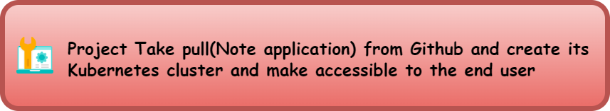
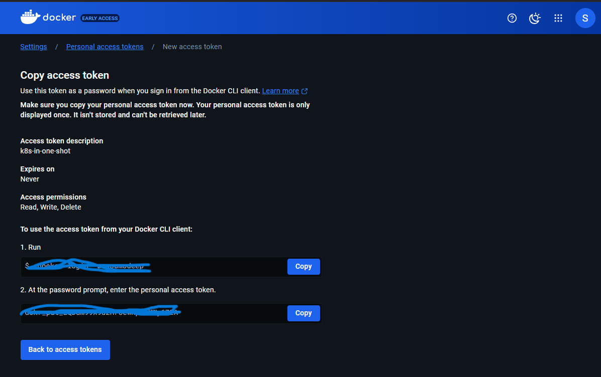
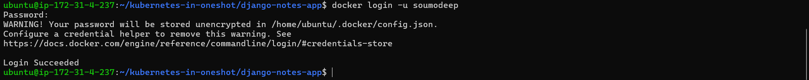
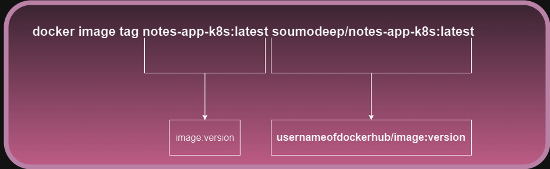
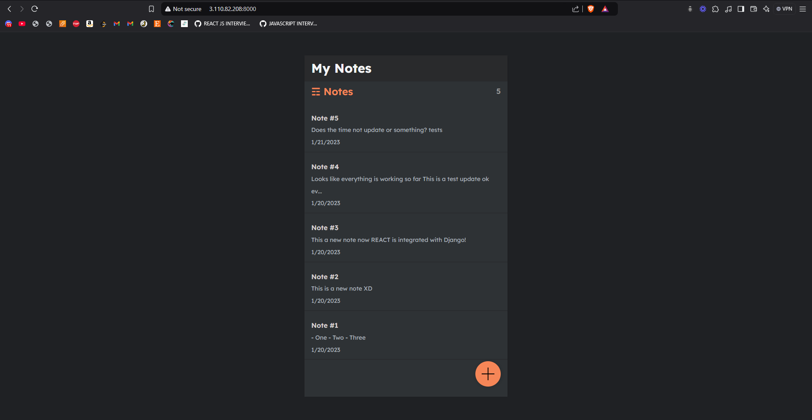
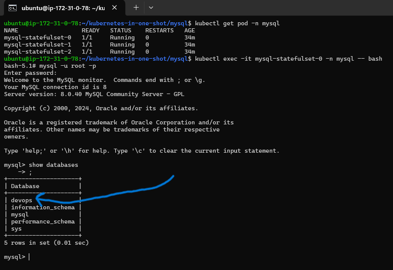
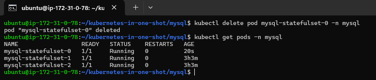

> # KUBERNETES TUTORIAL

> #### **Topics Covered**

1.  **Core Concept**: 
    1.  Monolith vs Microservices
    2.  Kubernetes Architecture
    3.  Setup on local / AWS EC2
    4.  Kubectl
    5.  Annotations
2.  **Workloadt**:
    1.  Deployments
    2.  Statefulsets
    3.  Daemonsets
    4.  Replicasets
    5.  Jobs
    6.  Cronjobs
3.  **Networking**:
    1.  Cluster Networking
    2.  Services
    3.  Ingress
    4.  Network Policies
4.  **Storage**:
    1.  Persistent Volume(PV)
    2.  Persistent Volume Claim (PVC)
    3.  Storage Classes
    4.  ConfigMaps
    5.  Secrets
5.  **Scaling and Scheduling**:
    1.  HPA
    2.  VPA
    3.  Node Affinity
    4.  Taints/ Tolerations
    5.  Resource Quotes
    6.  Limits
    7.  Probes
6.  Cluster Administration:
    1.  RBAC
    2.  Cluster Upgrade
    3.  Custom Resource Definitions (CRDs)
7.  Monitoring and Logging:
    1.  Matrics Server
    2.  Logging
    3.  Monitoring Tools
8.  Advanced Features:
    1.  Operators
    2.  Helm
    3.  Service Mesh
    4.  Kubernetes API
9.  Security:
    1.  Pod Security Standards (PSS)
    2.  Image Scanning
    3.  Network Policies
    4.  Secrets Encryption
10.  Cloud-Native Kubernetes:  
    1\. Managed Services (EKS, AKS, GKE)  
    2\. Cluster Autoscaler  
    3\. Spot/Preemptible Nodes
11.  Debugging and Troubleshooting:  
    1\. Kubectl Debugging  
    2\. Logs  
    3\. Resource Usage Analysis
12.  Projects:  
    1\. CI/CD Integration: Kubernetes with Jenkins CI/CD, GitOps with ArgoCD  
    2\. Microservices with MongoDB  
    3\. .Net, Python, Three-tier App  
    4\. Monitoring With Prometheus and Grafana

---

> ## _**Core concepts**_

_**2\. Kubernetes Architecture**_


1.  **Kubernetes Core Components**
    1.  API Server
        *   Acts as the central management hub for Kubernetes.
        *   Exposes the Kubernetes API, which users, tools (like `kubectl`), and internal components use to communicate.
        *   Ensures that all requests are authenticated and authorized before processing.
    2.  ETCD
        *   A distributed key-value store used to persist all cluster data.
        *   Stores configuration, state, and metadata of the cluster, ensuring high availability and consistency.
        *   Plays a crucial role in maintaining the desired state of the cluster.
    3.  Scheduler
        *   Assigns workloads (pods) to specific nodes based on resource availability and constraints.
        *   Ensures efficient utilization of cluster resources.
    4.  Controller Manager
        *   Runs control loops that manage state in the cluster.
        *   Includes controllers for:
            *   Node management.
            *   Pod replication.
            *   Service endpoint updates.
            *   Job completion tracking.
2.  **Node Components**
    1.  Kubelet
        *   An agent that runs on each node in the cluster.
        *   Ensures that containers specified in pod definitions are running and healthy.
        *   Communicates with the API Server to receive workload instructions.
    2.  Service Proxy
        *   Facilitates communication between pods and services.
        *   Implements network routing rules to distribute traffic to the appropriate pods.
        *   Can work with CNI plugins (like Weave Net, Calico) to manage network connectivity.
3.  **CNI Network**
    1.  **Container Network Interface (CNI):** Provides the networking layer for Kubernetes clusters
    2.  Examples include Weave Net, Calico, and Flannel.
    3.  Ensures seamless communication between nodes and pods.
4.  **Interection Flow**
    1.  User Interection
        *   Users interact with the cluster using the `kubectl` CLI or other Kubernetes tools.
        *   Requests are sent to the **API Server**.
    2.  Internal Communication
        *   The **API Server** coordinates with **ETCD**, **Scheduler**, and **Controller Manager** to enforce the desired state of the cluster.
        *   Nodes communicate with the **API Server** via **Kubelet**.
    3.  Networking
        *   CNI plugins handle networking, ensuring pods on different nodes can communicate effectively.
5.  **Node and Pod Management**
    1.  Nodes host pods (smallest deployable units) and their containers.
    2.  The **Kubelet** on each node ensures pods are running as expected.
    3.  The **Service Proxy** directs traffic to the correct pods using networking rules.

**This architecture ensures Kubernetes can efficiently manage and scale containerized applications while providing fault tolerance and high availability.**

> ###### _**Install and prepare kubernetes cluster in ec2 using KIND(Kubernetes in Docker)**_

_**step 1:**_ Create a EC2 instance

_**step 2:**_ Connect with SSH client

_**step 3:**_ Create a file called install\_kind.sh using command `vim install_kind.sh`

_**step 4:**_ pest the following code inside the file [reference.](https://github.com/LondheShubham153/kubestarter/tree/main/kind-cluster#1-installing-kind-and-kubectl)

```

#!/bin/bash

[ $(uname -m) = x86_64 ] && curl -Lo ./kind https://kind.sigs.k8s.io/dl/v0.20.0/kind-linux-amd64
chmod +x ./kind
sudo cp ./kind /usr/local/bin/kind

VERSION="v1.30.0"
URL="https://dl.k8s.io/release/${VERSION}/bin/linux/amd64/kubectl"
INSTALL_DIR="/usr/local/bin"

curl -LO "$URL"
chmod +x kubectl
sudo mv kubectl $INSTALL_DIR/
kubectl version --client

rm -f kubectl
rm -rf kind

echo "kind & kubectl installation complete."
```

And always take care of the version. In adove code the version is `v0.20.0` but the current actual version is `v0.26.0`  which is will get from [here.](https://kind.sigs.k8s.io/docs/user/quick-start/)


_**step 5:**_ Give permerision to that file to execute by executing the command `chmod 777 install_kind.sh` 

_**step 6:**_ To complete the installation of KIND and Kubectl in your ec2 instance we have to run `./install_kind.sh` .

_**step 7:**_ To run KIND we need to install Docker. To install Docker we need to run some commands

1.  `sudo apt-get update`
2.  `sudo apt-get install docker.io` 
3.  `docker ps`
4.  `sudo usermod -aG docker $USER && newgrp docker`

_**step 8:**_ Now check all the versions

1.  `docker --version`
2.  `kubectl version`

_**step 9:**_ We will create 4 nodes, where 1 node will be master node and 3 nodes will be worker node. To do that we need to configure a YML file. Run the command `vim config.yml` and then pest the code

```
kind: Cluster
apiVersion: kind.x-k8s.io/v1alpha4

nodes:
- role: control-plane
  image: kindest/node:v1.31.2
- role: worker
  image: kindest/node:v1.31.2
- role: worker
  image: kindest/node:v1.31.2
- role: worker
  image: kindest/node:v1.31.2
  extraPortMappings:
  - containerPort: 80
    hostPort: 80
    protocol: TCP
  - containerPort: 443
    hostPort: 443
    protocol: TCP
```

#### **General Overview**

*   **kind:** Specifies the resource type, which is `Cluster` in this case.
*   **apiVersion:** Defines the API version of the Kind configuration file (`kind.x-k8s.io/v1alpha4`).

#### **Node Configuration**

*   The `node` section defines the nodes of the cluster:
    *   **Control Plane Node:**
        *   Role: `control-plane`.
        *   Manages the cluster state and handles scheduling workloads.
        *   Uses the image: `kindest/node:v1.31.2`.
    *   **Worker Nodes:**
        *   Three worker nodes are defined to run workloads (pods).
        *   Each worker node uses the image: `kindest/node:v1.31.2`.

#### **Extra Port Mappings**

*   **Specific to the Last Worker Node:**
    *   **containerPort: 80 → hostPort: 80**
        *   Maps container port 80 to host port 80 for HTTP traffic.
    *   **containerPort: 443 → hostPort: 443**
        *   Maps container port 443 to host port 443 for HTTPS traffic.
    *   **Protocol: TCP**
        *   Specifies TCP as the communication protocol for these mappings.

_**step 10:**_ Run the command `kind create cluster --name=tws-cluster --config=config.yml` to create the cluster. 

*   `--name=tws-cluster` is referring that your want your cluster to be named `tws-cluster`
*   `--config=config.yml` is referring that the configuration file you are using to create the cluster, like here in this case you are using `config.yml` .  
    

To get information regarding cluster you have created run the command `kubectl cluster-info --context kind-tws-cluster`.

If you want to check how many number of nodes are running currently you have to run `kubectl get nodes`. And if you want to mention the cluster name then run command `kubectl get nodes --context kind-tws-cluster` .


_**Now you cluster creation using KIND is done**_

> To create cluster you can also use minikube. To install minikube you can take reference from [here](https://github.com/LondheShubham153/kubestarter/blob/main/minikube_installation.md)

> ## _**Namespace**_


### **Description of the Kubernetes Architecture in the Image**

#### **General Overview**

*   The image illustrates the workflow of two applications (NGINX and MySQL) deployed in Kubernetes.
*   Both applications follow a similar flow: **Namespace → Pod → Deployment → Service → Users**.

---

#### **Top Section: NGINX Application**

1.  **Namespace:**
    *   A logical partition within the Kubernetes cluster.
    *   Used to isolate the resources for the NGINX application.
2.  **Docker Container Running NGINX:**
    *   A Docker container running the NGINX web server application.
    *   Forms the basis of the Kubernetes pod.
3.  **Pod:**
    *   The smallest deployable unit in Kubernetes.
    *   Contains the Docker container running NGINX.
4.  **Deployment:**
    *   Manages the pods for the NGINX application.
    *   Ensures the desired number of pods is running and maintains updates or rollbacks.
5.  **Service:**
    *   Exposes the NGINX pods to external users.
    *   Acts as a load balancer for requests to the NGINX application.
6.  **Users:**
    *   External users access the NGINX service through the defined endpoints.

---

#### **Bottom Section: MySQL Application**

1.  **Namespace:**
    *   A separate logical partition for the MySQL application.
    *   Helps in isolating resources from other applications.
2.  **Docker Container Running MySQL:**
    *   A Docker container running the MySQL database service.
    *   Forms the foundation for the pod.
3.  **Pod:**
    *   Contains the MySQL container.
    *   Serves as the operational unit for the database workload.
4.  **Deployment:**
    *   Manages MySQL pods by ensuring availability and scaling.
    *   Handles updates and rollbacks for the MySQL service.
5.  **Service:**
    *   Exposes the MySQL pods to external or internal users.
    *   Facilitates communication with the database service using stable endpoints.
6.  **Users:**
    *   Users (or other applications) access the MySQL service through defined endpoints.

---

#### **Key Observations**

*   Both applications use the same Kubernetes components but operate independently in their respective namespaces.
*   Services abstract the complexities of exposing pods while ensuring seamless communication with users.
*   Deployments handle pod orchestration for reliability and scalability.

### **Some basic command for namespaces**

*   To get list of namespaces you can run command `kubectl get namespaces` or `kubectl get ns`
*   To get running pods list we can run command `kubectl get pods` . If you want to get running pods list in a specific namespace then run `kubectl get pods -n <namespace>`. if you don't mention namespace then this command will pick `default` namespace.
*   To create namespace run command `kubectl create ns <your-namespace>` for example: `kubectl create ns nginx`.
*   In this namespace we will create pod, deployment, services and this will make it accessable to the users.
*   Now run `kubectl run nginx --image=nginx` to create pod inside which a docker container will run of nginx image. in the above command first nginx is specifying to a pod name and the second nginx is specifying to the image name which k8s will get from docker registry. Now run `kubectl get pods` to get the list of running pods.
*   To delete pod run `kubectl delete pod nginx`, here nginx is pod name.
*   To create and run a pod in a specific namespace  you should run  `kubectl run nginx --image=nginx -n nginx` where the last nginx is refering to the name of the namespace.
*   To delete namespace run the command `kubectl delete ns nginx`.

> ## _**👉👉Create architecture above shown in then image (Namespace)**_

We will create this architecture by creating yml files, and we will work inside nginx folder.

**➡️STEP 1:** create a folder called nginx for work.

**➡️STEP 2:** create a yml file called `namespace.yml` and pest the code

```
kind: Namespace
apiVersion: v1
metadata:
 name: nginx
```

**➡️STEP 3:** run command `kubectl apply -f namespace.yml`

**➡️STEP 4:** create yml file `pod.yml` and pest the code

```
kind: Pod
apiVersion: v1
metadata:
 name: nginx-pod
 namespace: nginx
spec:
 containers:
   - name: nginx
     image: nginx:latest
     ports:
       - containerPort: 80
```

**➡️STEP 5:** run command `kubectl apply -f pod.yml`

> Note ▶ 
> 
> *   If you want to go inside the pod then run command `kubectl exec -it nginx-pod -n nginx --bash`
> *   If you want to debug your pod run the command `kubectl describe pod/nginx-pod -n nginx`  
>     

**➡️STEP 6:** for application scalibility we need deployment which will later increase or decrease the number of pods according to requirement or traffic. Create a file called `deployment.yml` and pest the code 

```
kind: Deployment
apiVersion: apps/v1
metadata:
 name: nginx-deployment
 namespace: nginx
spec:
 replicas: 2
 selector:
   matchLabels:
     app: nginx
 template:
   metadata:
     name: nginx-dep-pod
     labels:
       app: nginx
   spec:
     containers:
       - name: nginx
         image: nginx:latest
         ports:
           - containerPort: 80
```

**➡️STEP 7:** delete the pod first which we have create in previous step using command `kubectl delete -f pod.yml`, because in deployment.yml file we have included the pod creation instruction. 

**➡️STEP 8:** run the command `kubectl apply -f deployment.yml`. Now check the running deployments using command `kubectl get deployment -n nginx ` and check the running pods using command `kubectl get pods -n nginx`.

> Notes: 
> 
> *   to scale the application or (increase of decrease the number of pods/replicas) we can use the command `kubectl scale deployment/nginx-deployment -n nginx --replicas=5`
> *   To get more information about the running pods we can run the command `kubectl get pods -n nginx -o wide`  
>
> *   for doing any update regaiding the container inside the pods we can run command `kubectl set image deployment/nginx-deployment -n nginx nginx=nginx:1.27.3` . In this command we are trying to update the image version of nginx. In the process of updation, all the pod will not get updated at a time, some pods will be update and some pods will get update, like sequencially. In case if there will any error occored in the process of updation then the cluster will not get crushed, because some pod are still running with the old configuration.

**➡️STEP 9:** create yml file `service.yml` and pest the code and pest the code

```
kind: Service
apiVersion: v1
metadata:
 name: nginx-service
 namespace: nginx
spec:
 selector:
   app: nginx
 ports:
   - protocol: TCP
     port: 80
     targetPort: 80
 type: ClusterIP
```

**➡️STEP 10:** run the command `kubectl apply -f service.yml`

**➡️STEP 11:** after creating the service if you try to access the public ip in your browser, you will not able to do that, because nginx is running inside a container. it needs port forwarding, for that we need to run the command `kubectl port-forward service/nginx-service -n nginx 81:80 --address=0.0.0.0` or `sudo -E kubectl port-forward service/nginx-service -n nginx 81:80 --address=0.0.0.0`. after running this command we have to check if the port (in our case 81) is added to our inbound rule or not.

Now if you access using public ip ( in our case [`http://52.66.41.106:81/`](http://52.66.41.106:81/) ) then you will see the application is running.  
  
**🎉🎉 The above architecture is completed 🎉🎉**


For replicaSets we can create a file called `replicasets.yml` and pest the code

```
kind: ReplicaSet
apiVersion: apps/v1
metadata:
 name: nginx-replicasets
 namespace: nginx
spec:
 replicas: 2
 selector:
   matchLabels:
     app: nginx
 template:
   metadata:
     name: nginx-rep-pod
     labels:
       app: nginx
   spec:
     containers:
       - name: nginx
         image: nginx:latest
         ports:
           - containerPort: 80
```

then run the command `kubectl apply -f replicasets.yml`

to get list of replica sets run command `kubectl get replicasets -n nginx`


For replicaSets we can create a file called `daemonsets.yml` and pest the code

```
kind: DaemonSet
apiVersion: apps/v1
metadata:
 name: nginx-daemonsets
 namespace: nginx
spec:
 selector:
   matchLabels:
     app: nginx
 template:
   metadata:
     name: nginx-dmn-pod
     labels:
       app: nginx
   spec:
     containers:
       - name: nginx
         image: nginx:latest
         ports:
           - containerPort: 80
```

then run the command `kubectl apply -f daemonsets.yml`

  
Jobs represent one-off tasks that run to completion and then stop.

A Job creates one or more Pods and will continue to retry execution of the Pods until a specified number of them successfully terminate. As pods successfully complete, the Job tracks the successful completions. When a specified number of successful completions is reached, the task (ie, Job) is complete. Deleting a Job will clean up the Pods it created. Suspending a Job will delete its active Pods until the Job is resumed again.

A simple case is to create one Job object in order to reliably run one Pod to completion. The Job object will start a new Pod if the first Pod fails or is deleted (for example due to a node hardware failure or a node reboot).

You can also use a Job to run multiple Pods in parallel.

> 👉👉 _**Create a job**_

**➡️STEP 1:** create a file `vim job.yml`

**➡️STEP 2:** pest the code inside that file

```
kind: Job
apiVersion: batch/v1
metadata:
 name: demo-job
 namespace: nginx
spec:
 completions: 2
 parallelism: 1
 template:
   metadata:
     name: demo-job-pod
     labels:
       app: batch-task
   spec:
     containers:
       - name: batch-container
         image: busybox:latest
         command: ["sh", "-c", "echo Hello Dosto! && sleep 10"]
     restartPolicy: Never
```

you should have create namespace before hand, otherwise this above code will not work.

**➡️STEP 3:** run the command `kubectl apply -f job.yml`

**➡️STEP 4:** run the command to check the status of you job `kubectl get job -n nginx`

**➡️STEP 5:** run the command to check the pod has created or not `kubectl get pods -n nginx`

**➡️STEP 6:** copy the pod name and run the command `kubectl logs pod/demo-job-97kh7 -n nginx` 

**➡️STEP 7:** to delete the job run command `kubectl delete -f job.yml`  


  
A _CronJob_ creates [Jobs](https://kubernetes.io/docs/concepts/workloads/controllers/job/) on a repeating schedule.

CronJob is meant for performing regular scheduled actions such as backups, report generation, and so on.

```
kind: CronJob
apiVersion: batch/v1
metadata:
 name: minute-backup
 namespace: nginx
spec:
 schedule: "* * * * *"
 jobTemplate:
   spec:
     template:
       metadata:
         name: minute-backup
         labels:
           app: minute-backup
       spec:
         containers:
         - name: backup-container
           image: busybox
           command:
           - sh
           - -c
           - >
             echo "Backup Started" ;
             mkdir -p /backups &&
             mkdir -p /demo-data &&
             cp -r /demo-data /backups &&
             echo "Backup Completed" ;
           volumeMounts:
             - name: data-volume
               mountPath: /demo-data
             - name: backup-volume
               mountPath: /backups
         restartPolicy: OnFailure
         volumes:
           - name: data-volume
             hostPath:
               path: /demo-data
               type: DirectoryOrCreate
           - name: backup-volume
             hostPath:
               path: /backups
               type: DirectoryOrCreate
```

  
All the commands are mentioned in the above image sc

  
👉👉👉👉👉👉👉 **TODO 👈👈👈👈👈👈👈**



Taking [`https://github.com/LondheShubham153/django-notes-app.git`](https://github.com/LondheShubham153/django-notes-app.git) this repo for our project. After cloning this repo check out to `dev` branch

**➡️STEP 1:**  run command  `git clone` [`https://github.com/LondheShubham153/django-notes-app.git`](https://github.com/LondheShubham153/django-notes-app.git)

**➡️STEP 2:**  run command `git checkout dev`

**➡️STEP 3:**  run command `docker build -t notes-app-k8s .`

**➡️STEP 4:**  run command `docker images` to check if the image has created or not

**➡️STEP 5:**  login to the docker account in command line through below steps

1.   Login to docker hub in browser
2.  Go to setting -> Personal Access Token ->  New access token 
3.  copy the first command from the above image and paste in the cmd and press enter
4.  then it will ask password, copy the second one from the above image and pest in the password section 

**➡️STEP 6:** now tag your image using command `docker image tag notes-app-k8s:latest soumodeep/notes-app-k8s:latest` 

**➡️STEP 7:** run command `docker push soumodeep/notes-app-k8s:latest` to push your local docker image to your docker registry.

**➡️STEP 8:** create another folder called k8s and move inside this folder

**➡️STEP 9:** create deployment running command `vim deployment.yml` and pest the code

```
kind: Deployment
apiVersion: apps/v1
metadata:
 name: notes-app-deployment
 labels:
   app: notes-app
 namespace: notes-app
spec:
 replicas: 1
 selector:
   matchLabels:
     app: notes-app
 template:
   metadata:
     labels:
       app: notes-app
   spec:
     containers:
       - name: notes-app
         image: soumodeep/notes-app-k8s
         ports:
           - containerPort: 8000
```

**➡️STEP 10:** create namespace running command `vim namespace.yml` and pest the code

```
kind: Namespace
apiVersion: v1
metadata:
 name: notes-app
```

**➡️STEP 11:** create service running command `vim namespace.yml` and pest the code

```
kind: Service
apiVersion: v1
metadata:
 name: notes-app-service
 namespace: notes-app
spec:
 selector:
   app: notes-app
 ports:
   - protocol: TCP
     port: 8000
     targetPort: 8000
 type: ClusterIP
```

**➡️STEP 12:** now run the commands sequentially

1.  `kubectl apply -f namespace.yml`
2.  `kubectl apply -f deployment.yml`
3.  `kubectl apply -f service.yml`

**➡️STEP 13:** now run command `kubectl port-forward service/notes-app-service -n notes-app 8000:8000 --address=0.0.0.0` for port forwarding.

**➡️STEP 14:** now you have to white list your port 8000 through setting inbound rule in ec2 instance.

**➡️STEP 15:** now if you go to your browser and pest the url [`http://3.110.82.208:8000/`](http://3.110.82.208:8000/) then you will see your application is running in kubernetes.  


**🎉🎉 The project is completed 🎉🎉**


👉👉👉👉👉👉👉 **TODO 👈👈👈👈👈👈👈**

  
A StatefulSet runs a group of Pods, and maintains a sticky identity for each of those Pods. This is useful for managing applications that need persistent storage or a stable, unique network identity.

Like a [Deployment](https://kubernetes.io/docs/concepts/workloads/controllers/deployment/), a StatefulSet manages Pods that are based on an identical container spec. Unlike a Deployment, a StatefulSet maintains a sticky identity for each of its Pods. These pods are created from the same spec, but are not interchangeable: each has a persistent identifier that it maintains across any rescheduling.

If you want to use storage volumes to provide persistence for your workload, you can use a StatefulSet as part of the solution. Although individual Pods in a StatefulSet are susceptible to failure, the persistent Pod identifiers make it easier to match existing volumes to the new Pods that replace any that have failed.


**➡️STEP 1:**  run command `vim statefulsets.yml` and pest the code 

```
kind: StatefulSet
apiVersion: apps/v1
metadata:
 name: mysql-statefulset
 namespace: mysql
spec:
 serviceName: mysql-service
 replicas: 3
 selector:
   matchLabels:
     app: mysql
 template:
   metadata:
     labels:
       app: mysql
   spec:
     containers:
     - name: mysql
       image: mysql:8.0
       ports:
       - containerPort: 3306
       env:
       - name: MYSQL_ROOT_PASSWORD
         value: root
       - name: MYSQL_DATABASE
         value: devops
       volumeMounts:
       - name: mysql-data
         mountPath: /var/lib/mysql
 volumeClaimTemplates:
 - metadata:
     name: mysql-data
   spec:
     accessModes: [ "ReadWriteOnce" ]
     resources:
       requests:
         storage: 1Gi
```

**➡️STEP 2:** run command `vim namespace.yml ` and pest the code

```
kind: Namespace
apiVersion: v1
metadata:
 name: mysql
```

**➡️STEP 3:** run command `vim service.yml ` and pest the code

```
kind: Service
apiVersion: v1
metadata:
 name: mysql-service
 namespace: mysql
spec:
 clusterIP: None
 selector:
   app: mysql
 ports:
   - name: mysql
     protocol: TCP
     port: 3306
     targetPort: 3306
```

**➡️STEP 4:** now run these commands sequentianly

1.  `kubectl apply -f namespace.yml`
2.  `kubectl apply -f service.yml`
3.  `kubectl apply -f statefulsets.yml`

**➡️STEP 5:** go inside mysql bash using command `kubectl exec -it mysql-statefulset-0 -n mysql -- bash`

and check if your database is created or not using command `show databases;`  
  
in the above picture we can see the db has create successfully.

now if you delete any one pod using command `kubectl delete pod mysql-statefulset-0 -n mysql`  
then with the same name another pod will be created at the same time, in other cases that will not happen  



A ConfigMap is an API object used to store non-confidential data in key-value pairs. [Pods](https://kubernetes.io/docs/concepts/workloads/pods/) can consume ConfigMaps as environment variables, command-line arguments, or as configuration files in a [volume](https://kubernetes.io/docs/concepts/storage/volumes/).

A ConfigMap allows you to decouple environment-specific configuration from your [container images](https://kubernetes.io/docs/reference/glossary/?all=true#term-image), so that your applications are easily portable.

lets create configmap file and take mysql cluster to demonstrate the usecase of configmap.

**➡️STEP 1:**  create a file configmap.yml `vim configmap.yml` pest the code 

```
kind: ConfigMap
apiVersion: v1
metadata:
 name: mysql-config-map
 namespace: mysql
data:
 MYSQL_DATABASE: devops
```

**➡️STEP 2:** update the statefulsets.yml file in `env` section

```
kind: StatefulSet
apiVersion: apps/v1
metadata:
 name: mysql-statefulset
 namespace: mysql
spec:
 serviceName: mysql-service
 replicas: 3
 selector:
   matchLabels:
     app: mysql
 template:
   metadata:
     labels:
       app: mysql
   spec:
     containers:
     - name: mysql
       image: mysql:8.0
       ports:
       - containerPort: 3306
       env:
       - name: MYSQL_ROOT_PASSWORD
         value: root
       - name: MYSQL_DATABASE
         valueFrom:
           configMapKeyRef:
             name: mysql-config-map
             key: MYSQL_DATABASE
       volumeMounts:
       - name: mysql-data
         mountPath: /var/lib/mysql
 volumeClaimTemplates:
 - metadata:
     name: mysql-data
   spec:
     accessModes: [ "ReadWriteOnce" ]
     resources:
       requests:
         storage: 1Gi
```

**➡️STEP 3:** run command `kubectl apply -f configmap.yml`

**➡️STEP 4:** first delete the existing stateful set running command `kubectl delete mysql-statefuset -n mysql`

**➡️STEP 5:** then run `kubectl apply -f statefulsets.yml`

**➡️STEP 6:** check pods are created or not `kubectl get pods -n mysql`

  
sdf